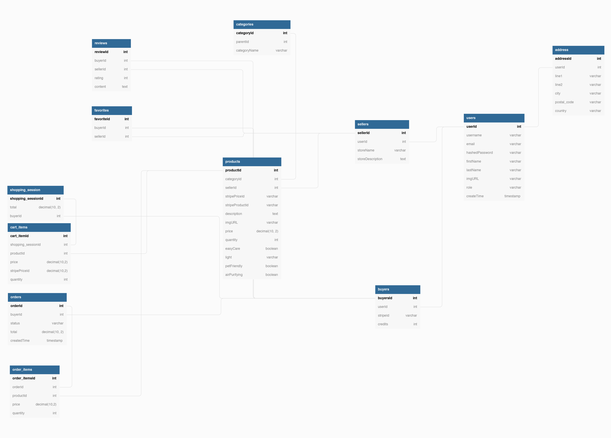

## Flora

# Project Description

FLORA ia an e-commerce website with multiple vendors, where users are able to sell and buy plants. Buyers can register, search, add products to their cart and purchase plants while sellers may add products to their catalog and manage their profile.

## Project Setup 

# Backend 

- Type `mysql -u root -p` to access the MySQL CLI using your password.
- Create the database in the MySQL CLI, type `create database flora;`
- Create `.env` file 

`DB_NAME = flora`
`DB_PASS= YOUR_PASSWORD`
`DB_HOST=127.0.0.1`

- Run `npm install` in a new terminal

- Run `npm start` in project directory to start the Express server on port 5000

- Run `npm run migrate` in a new terminal 

- Run `npx sequelize-cli db:seed:all`

# Frontend
 
- In the terminal `cd client` and run `npm install`

- Run `npm start`

- Test client with: `http://localhost:3000`
- Test API with: `http://localhost:5000/api`

# API

- Stripe: Third party API that accepts online payment

- Generate and save API key in `.env` file in StripeAPI directory:

`STRIPE_SECRET_KEY=YOUR API KEY`
`WEB_APP_URL=http://localhost:3000`

_Resourses : https://stripe.com/docs/financial-services_
_https://stripe.com/docs/api_

# Database Schema

## User Flow

# Buyer

# Seller

## Notes

_This is a student project that was created at [CodeOp](http://codeop.tech) by Joy Williams, Kanykei Dzhusupova and Maria Beatriz Maclagan a full stack development bootcamp in Barcelona._